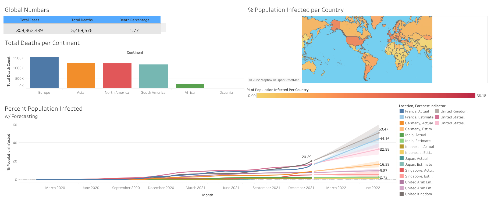

# WHO COVID-19 Dashboard

This project is namely used to display competency in Tableau. OWID's [COVID-19](https://ourworldindata.org/covid-deaths) data from 19 January 2020 - 2 January 2022 is used for this analysis. SQL Server was used for data processing before importing to Tableau to create the dashboard.

The dashboard showcases metrics such as Total Deaths, Total Cases, COVID-19 Deaths as a % of the Population, and a geographic heatmap. As well as infection trends through the months, and a forecast until June 2022.

## Dataset Used

The OWID dataset has been split into two separate tables, covid_deaths & covid_vaccinations
The following tables will be used: 

| Table Name | Type | Description |
| --- | --- | --- |
| 1. DIM_Calendar | Microsoft Excel CSV | Datekey, Date, Day, WeekNr, Month, Quarter, Year |
| 2. DIM_Customer | Microsoft Excel CSV | Table of customers by Name, Gender, Country, City, State  |
| 3. DIM_Products | Microsoft Excel CSV | Table of products by ProductKey, ProductItemCode, ProductName, Subcategory, ProductCategory, ModelName, Production Description |
| 4. FACT_Budget | Microsoft Excel CSV | Table of monthly budget. Date, Budget |
| 5. FACT_InternalSales | Microsoft Excel CSV | Table of product sales by ProductKey, OrderDate, DueDateKey, ShipDateKey, CustomerKey, SalesOrderNum, SalesAmount, OrderDate |

## Viewing the Dashboard

You may view the dashboard [here](https://public.tableau.com/app/profile/zulkhairee.sulaiman/viz/Covid-19PortfolioProject_16419297626140/Dashboard1) on Tableau Public. 
However, for easy viewing, images of the dashboard is available below. 

### Acknowledgments

This portfolio was created as part of [Ali Ahmad's](https://www.youtube.com/watch?v=z7o5Wju-PZg&list=PLMfXakCUhXsEUtk8c0zWr4whamGxLhAu0)
6-part series on how to create a data analyst portfolio project. 
